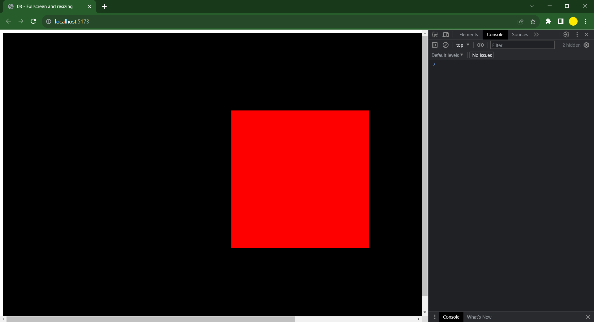
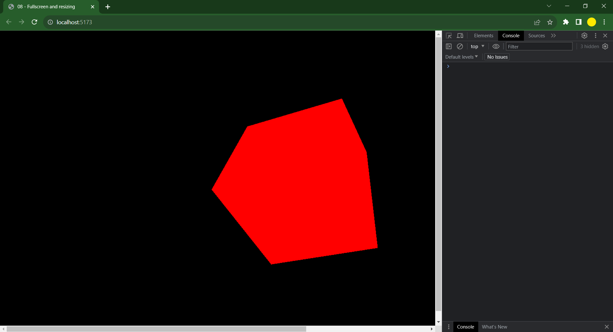
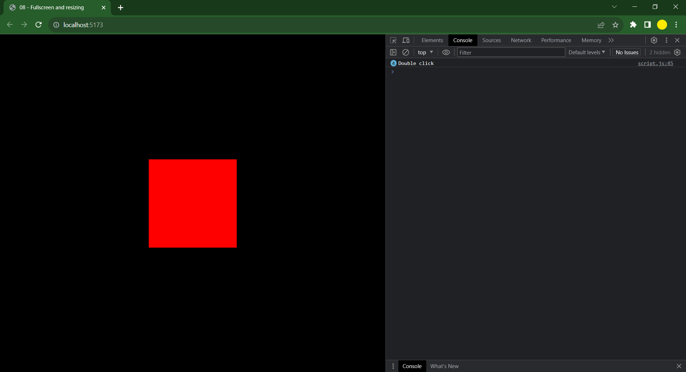
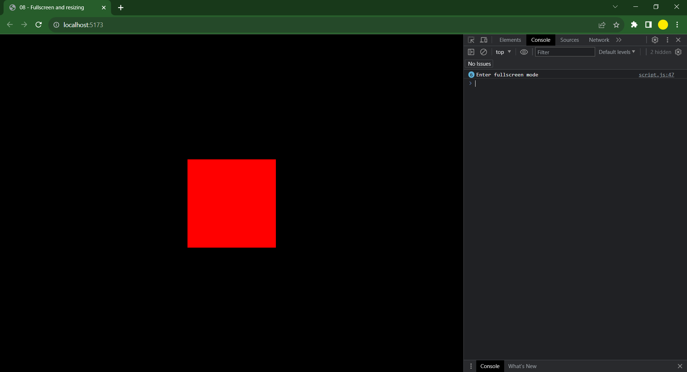
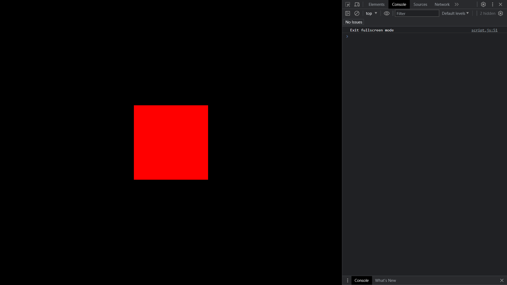

# Three.js

## Full Screen and Resizing

- We did use a canvas size of **800** by **600**, our aim is to resize the canvas as the browser screen size and to do that we can detect the size using **window.innerWidth** and **window.innerHeight**.

- The code would be altered to

```
const sizes = {
    width: window.innerWidth,
    height: window.innerHeight
}
```

- The canvas has resized like this,



- We can notice a small border on the webpage that can be altered by styling the page using **CSS**. We can make **Margin** and **Padding** zero for each element of a webpage.

```
* {
    margin: 0;
    padding: 0;
}
```

- It has resized well but there are scrollbars visible we need to eliminate them.



- This piece of code can eliminate it

```
.webgl {
    position: fixed;
    top: 0;
    left: 0;
    outline: none;
}
```

- This is amazing and we want to prevent the user from scrolling beyond the webpage that would display a white screen to do that we can do it by:

```
html,
body {
    overflow: hidden;
}
```

- As of now the resolution is best for desktop but this isn't multiple screen size friendly and we want the page to automatically resize based on the requirement so to do that we will use **addEventListener** to detect the screen resizing change and tell us when the screen has been resized.

```
window.addEventListener('resize', () =>
{
    console.log("Screen has been resized")
})
```


- As the change is detected we can get to know that the function is working in this function we need to write some code and convey the machine to resize as the screen is resized it must adjust accordingly based on width and height.

- We need to track the changes of page size, camera aspect ratio and renderer ration and then make it reflect on the visual.

```
window.addEventListener('resize', () =>
{
    // Update Sizes
    sizes.width = window.innerWidth,
    sizes.height = window.innerHeight

    // Update camera aspect ratio based on the updated size and width
    camera.aspect = sizes.width / sizes.height
    camera.updateProjectionMatrix() // The update needs to be conveyed

    // Update the renderer
    renderer.setSize(sizes.width, sizes.height)
})
```

- Now everything is resizing well and now we need to ensure the clarity is high across all screen tyoes so we can achieve that using **Pixel Ratio**. It is the number of renders per pixel a renderer has to perform as it is a 2D screen if the pixel ratio is 1 it needs to do one render per screen. If it is 2 then it should do 4 renders. As the ratio increases the renderer has more work to do and it becomes heavy.

- We have a pixel ratio of 1.25 and we want three.js to render as per that pixel ratio of any screen the user is viewing and we can make it happen by:

```
renderer.setPixelRatio(window.devicePixelRatio)
```

- What if the pixel ratio is high we don't want our renderer to struggle so we can set a limit by:

```
renderer.setPixelRatio(Math.min(window.devicePixelRatio,2))
```

- This should happen when the screen is also resized so we can do that by adding the same piece of code in resize function.

```
window.addEventListener('resize', () =>
{
    // Update Sizes
    sizes.width = window.innerWidth,
    sizes.height = window.innerHeight

    // Update camera aspect ratio based on the updated size and width
    camera.aspect = sizes.width / sizes.height
    camera.updateProjectionMatrix() // The update needs to be conveyed

    // Update the renderer
    renderer.setSize(sizes.width, sizes.height)
    renderer.setPixelRatio(Math.min(window.devicePixelRatio,2))
})
```

- We want to move the browser to a fullscreen mode to enhance the user experience so to do that we can do it by adding an event listener for double click.

```
window.addEventListener('dblclick', () => // dblclick is an event.
{
    console.log("Double click")
})
```



- Now that the double click is being detected we need to make a loop that switches from fullscreen to previous ratio and vice-versa.

```
window.addEventListener('dblclick', () =>
{
    if(!document.fullscreenElement)
    {
        console.log("Enter fullscreen mode")
    }
    else
    {
        console.log("Exit fullscreen mode")
    }
})
```



- As we are not in fullscreen mode we can see that the device is trying to enter full screen. For giving it ability to enter the fullscreen we can make it happen by.

```
window.addEventListener('dblclick', () =>
{
    if(!document.fullscreenElement)
    {
        canvas.requestFullscreen() // Make the canvas enter fullscreen
    }
    else
    {
        console.log("Exit fullscreen mode")
    }
})
```



- To make the double click leave the fullscreen

```
window.addEventListener('dblclick', () =>
{
    if(!document.fullscreenElement)
    {
        canvas.requestFullscreen() // Make the canvas enter fullscreen
    }
    else
    {
        document.exitFullscreen()
    }
})
```

- If the user is not working on a supportable browser we can use conventional webkit to make it happen

```
window.addEventListener('dblclick', () =>
{
    const fullscreenElement = document.fullscreenElement || document.webkitFullscreenElement
    if(!fullscreenElement)
    {
        if(canvas.requestFullscreen) // If this is present this will work
        {
            canvas.requestFullscreen()
        }
        else if(canvas.webkitRequestFullscreen)  // Otherwise this will work
        {
            canvas.webkitRequestFullscreen()
        }
    }
    else
    {
        if(document.exitFullscreen()) // Same for exit to if this works then ok if not that
        {
            document.exitFullscreen()
        }
        else if (document.webkitExitFullscreen())
        {
            document.webkitExitFullscreen()
        }
    }
})
```
