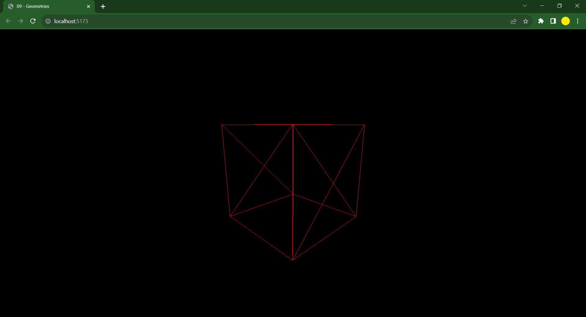
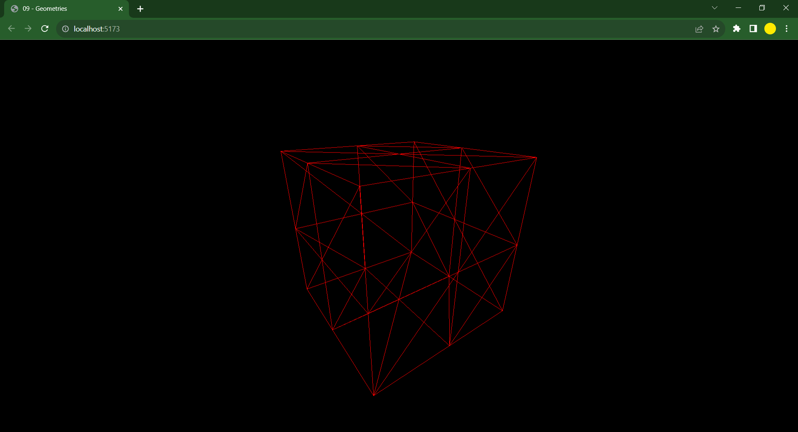
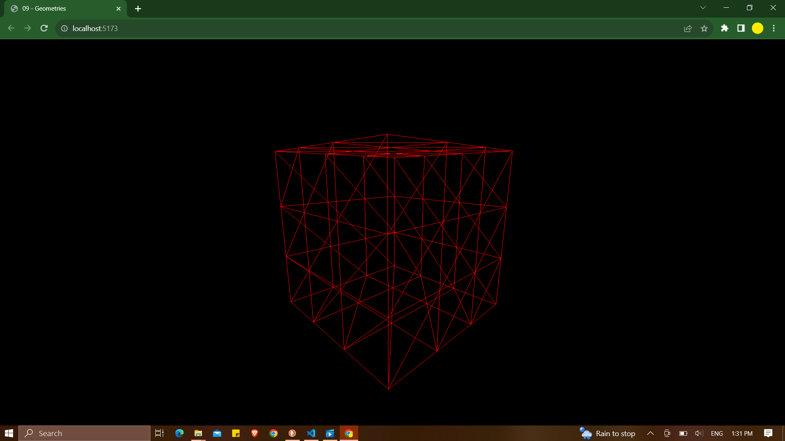
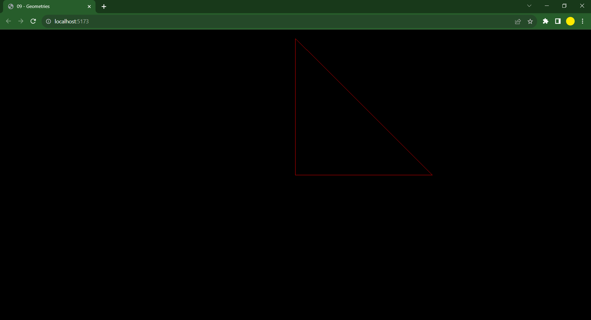
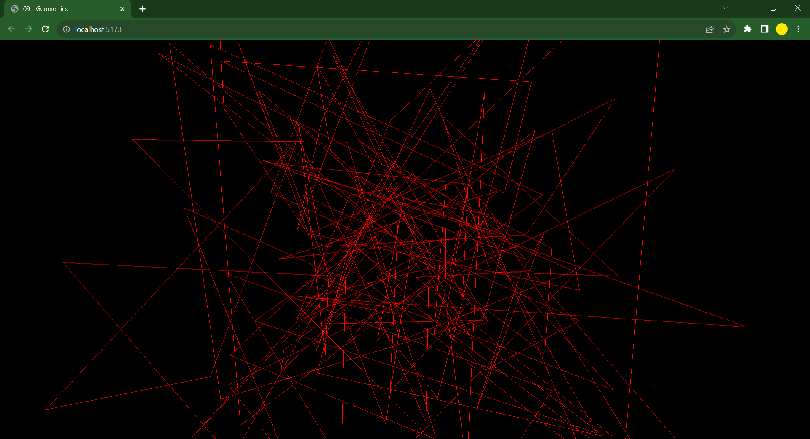

# Three.js

## Geometries

- **Geometries** are a set of vertices, those vertices linked together form faces that would be visible on the scene.

- There are **built-in** geometries and **user-defined** geometries too.

- Talking about **built-in** geometries there are many types and those are

| Sl.no |   Type of Geometry   |
| :---: | :------------------: |
|  1.   |     BoxGeometry      |
|  2.   |    PlainGeometry     |
|  3.   |    CircleGeometry    |
|  4.   |     ConeGeometry     |
|  5.   |   CylinderGeometry   |
|  6.   |     RingGeometry     |
|  7.   |    TorusGeometry     |
|  8.   |  TorusKnotGeometry   |
|  9.   | DodecahedronGeometry |
|  10.  |  OctahedronGeometry  |
|  11.  | TetrahedronGeometry  |
|  12.  | IcosahedronGeometry  |
|  13.  |    SphereGeometry    |
|  14.  |    ShapeGeometry     |
|  15.  |     TubeGeometry     |
|  16.  |   ExtrudeGeometry    |
|  17.  |    LatheGeometry     |
|  18.  |     TextGeometry     |

- Refer the [documentation](https://threejs.org/) for their more knowledge.

- With these wide range of combinations we can create amazing geometries to create models to render. If you aren't satisfied then go ahead with 3D applications like blender.

- There are totally six parameters in **BoxGeometry**. We only used X, Y and Z coordinates. There are three more parameters and those are **widthSegments**, **heightSegments** and **depthSegments**.

- These three paramters determine the number of segments are present in a **BoxGeometry** in X, Y and Z coordinates.

- The **Segments** parameters are used to define the number of sub-divisions on a certain axis. **widthSegment** for **X** axis, **heightSegment** for **Y** axis and **depthSegment** for **Z** axis.

- If the **Segment** parameter is 1 then it will generate 2 triangles and if it is 2 then it will generate 8 triangles if it is 3 then 18 triangles.

- When we apply the parameter that won't be visible because the cube is a solid fill inorder to make that grid visible we need to enable the **wireframe** in the **material** section.

```
// Object
const geometry = new THREE.BoxGeometry(1, 1, 1, 3, 3, 3)
const material = new THREE.MeshBasicMaterial({
    color: 0xff0000,
    wireframe: true
})
const mesh = new THREE.Mesh(geometry, material)
scene.add(mesh)
```

- If the segments are 1 then, it will look like this:
  

- If the segments are 2 then, it will look like this:
  

- If the segments are 3 then, it will look like this:
  

- To create our own geometry we can do it by **BufferGeometry** and for creating that type of geometry we can use **Float32Array**.

- To create an object using this array we can do it by:

```
// Object
const positionsArray = new Float32Array(9)

positionsArray[0] = 0
positionsArray[1] = 0
positionsArray[2] = 0

positionsArray[3] = 0
positionsArray[4] = 1
positionsArray[5] = 0

positionsArray[6] = 1
positionsArray[7] = 0
positionsArray[8] = 0
```

- Another way to do it is:

```
const positionsArray = new Float32Array([
    0,0,0,
    0,1,0,
    1,0,0
])
```

- After this we need to create an attribute and then we need to create a geometry to add the buffer to that geometry.

```
const positionsAttribute = new THREE.BufferAttribute(positionsArray, 3)
```

- Then you add that attribute to your geometry

```
const geometry = new THREE.BufferGeometry()
geometry.setAttribute('position', positionsAttribute)
```

- The output will be like this:



- If we had to create a bunch of triangles then we can do it by defining the geometry first,

```
const geometry = new THREE.BufferGeometry()
```

- Then, we will decide on the number of triangles we want and inputs required for them,

```
const count = 50 // Number of triangles
const positionsArray = new Float32Array(count * 3 * 3)
```

- We want assign the triangles random coordinates we will use for loop with random function so to do that we can write the code like this,

```
for(let i=0; i < count*3*3; i++) // Defining the positions of the triangle
{
    positionsArray[i] = (Math.random() - 0.5) * 4
}
```

- After this we define the attribute and set the attribute by:

```
const positionsAttribute = new THREE.BufferAttribute(positionsArray, 3)
geometry.setAttribute('position', positionsAttribute)
```

- The output of it will be this:



- FINAL CODE

```
import * as THREE from 'three'
import { OrbitControls } from 'three/examples/jsm/controls/OrbitControls.js'

/**
 * Base
 */
// Canvas
const canvas = document.querySelector('canvas.webgl')

// Scene
const scene = new THREE.Scene()

// Object

// 50 Triangles
const geometry = new THREE.BufferGeometry()

const count = 50 // Number of triangles
const positionsArray = new Float32Array(count * 3 * 3)

for(let i=0; i < count*3*3; i++) // Defining the positions of the triangle
{
    positionsArray[i] = (Math.random() - 0.5) * 4
}

const positionsAttribute = new THREE.BufferAttribute(positionsArray, 3)
geometry.setAttribute('position', positionsAttribute)

// 1 Triangle

/* const positionsArray = new Float32Array([
    0,0,0,
    0,1,0,
    1,0,0
])

const positionsAttribute = new THREE.BufferAttribute(positionsArray, 3)

const geometry = new THREE.BufferGeometry()
geometry.setAttribute('position', positionsAttribute) */

/* const geometry = new THREE.BoxGeometry(1, 1, 1, 3, 3, 3)*/
const material = new THREE.MeshBasicMaterial({
    color: 0xff0000,
    wireframe: true
})
const mesh = new THREE.Mesh(geometry, material)
scene.add(mesh)

// Sizes
const sizes = {
    width: window.innerWidth,
    height: window.innerHeight
}

window.addEventListener('resize', () =>
{
    // Update sizes
    sizes.width = window.innerWidth
    sizes.height = window.innerHeight

    // Update camera
    camera.aspect = sizes.width / sizes.height
    camera.updateProjectionMatrix()

    // Update renderer
    renderer.setSize(sizes.width, sizes.height)
    renderer.setPixelRatio(Math.min(window.devicePixelRatio, 2))
})

// Camera
const camera = new THREE.PerspectiveCamera(75, sizes.width / sizes.height, 0.1, 100)
camera.position.z = 3
scene.add(camera)

// Controls
const controls = new OrbitControls(camera, canvas)
controls.enableDamping = true

// Renderer
const renderer = new THREE.WebGLRenderer({
    canvas: canvas
})
renderer.setSize(sizes.width, sizes.height)
renderer.setPixelRatio(Math.min(window.devicePixelRatio, 2))

// Animate
const clock = new THREE.Clock()

const tick = () =>
{
    const elapsedTime = clock.getElapsedTime()

    // Update controls
    controls.update()

    // Render
    renderer.render(scene, camera)

    // Call tick again on the next frame
    window.requestAnimationFrame(tick)
}

tick()
```
