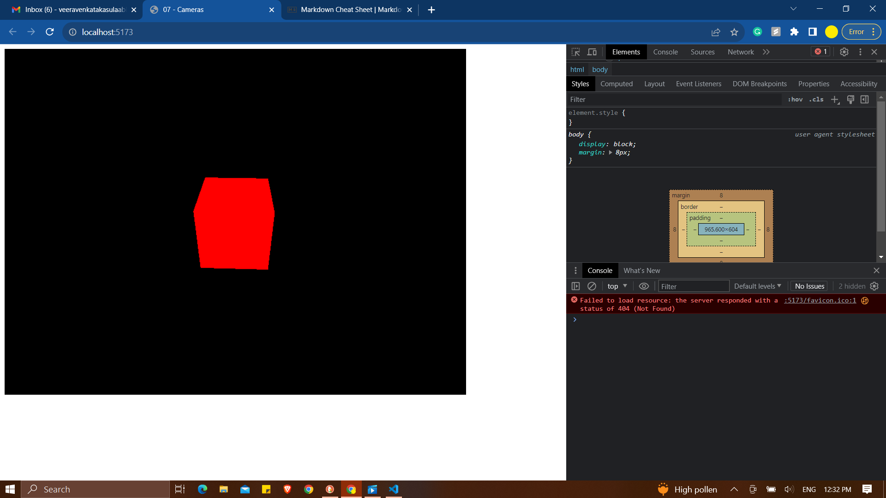
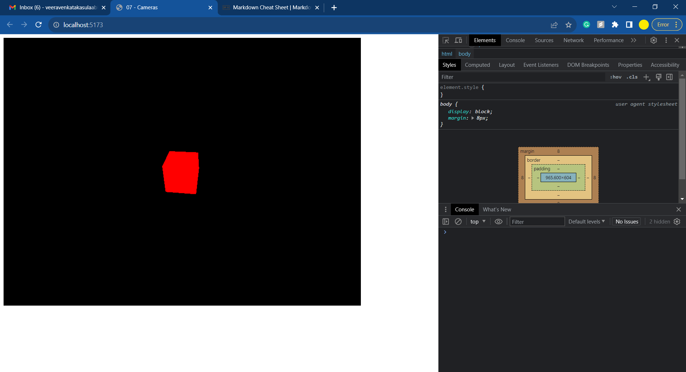
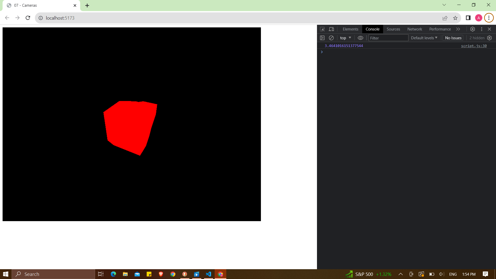
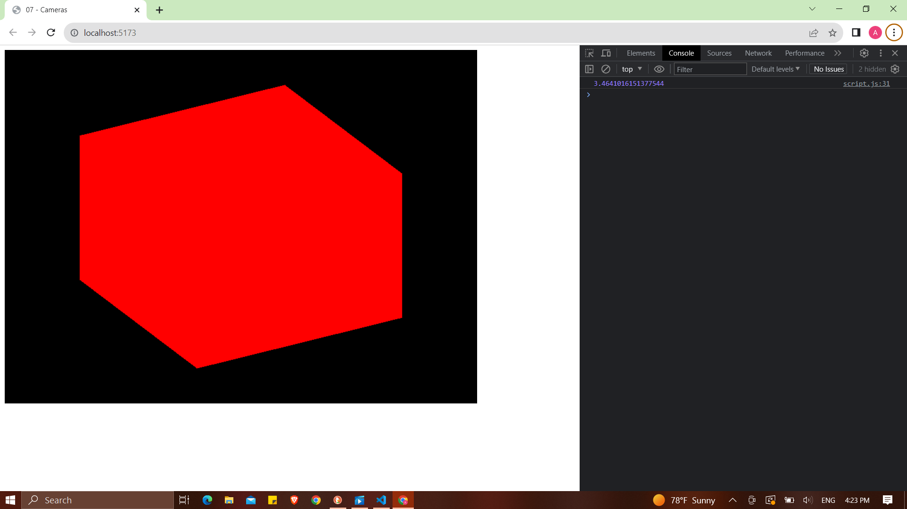

# Three.js

## Cameras

- There are 6 types of cameras and those are:

1. Camera
2. ArrayCamera
3. CubeCamera
4. OrthographicCamera
5. PerspectiveCamera
6. StereoCamera

- **Camera** class cannot be used directly and the rest of the cameras are inherited from them.

- **ArrayCamera** can be used to render the scene from multiple cameras on specific areas of the render.

- **StereoCamera** can be used to render the scene through two cameras that mimic the eyes to create the parallax effect.

- **CubeCamera** does the render for each one facing a different direction.

- **OrthographicCamera** does the render of the scene without any perspective.

- **PerspectiveCamera** is the most common one with max parameters.

```
const camera = new THREE.PerspectiveCamera(75, sizes.width / sizes.height)
```

- Here is the command for initializing the camera and the parameter **75** is known as field of view **FOV**.



- _FOV of 75_



- _FOV of 105_

### Near and Far

- These are the parameters that are used to define how close or far the camera is.

- Don't use extreme parameters then the model won't be displayed properly as shown in the picture below. These tend to glitches in the real-time environment.`

- 

- The default code for defining near and far is by:

```
const camera = new THREE.PerspectiveCamera(75, sizes.width / sizes.height,0.00001,3.4641016151377544)
camera.position.x = 2
camera.position.y = 2
camera.position.z = 2
camera.lookAt(mesh.position)
scene.add(camera)
```

### Orthographic Camera

- Till now we had been using perspective camera now we are switching to orthographic. The syntax for initializing an orthographi camera is:

```
const camera = new THREE.OrthographicCamera(left, right, top, bottom, near, far) // Coordinates are important
const camera = new THREE.OrthographicCamera(-1,1,1,-1, 0.1, 100)
```



- Now here the cube is not like a cube in the scene and it responds and acts accordingly to the height of the render screen.

- To fix that we can define the aspect ratio as the ratio of width and height of the render screen and multiply it to the left and right variable.

```
const aspectRatio = sizes.width / sizes.height
const camera = new THREE.OrthographicCamera(-1*aspectRatio,1*aspectRatio,1,-1,0.1,100)
camera.position.x = 2
camera.position.y = 2
camera.position.z = 2
console.log(aspectRatio)
camera.lookAt(mesh.position)
scene.add(camera)
```

-
