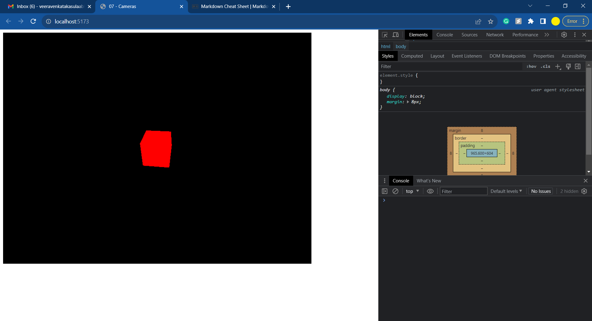
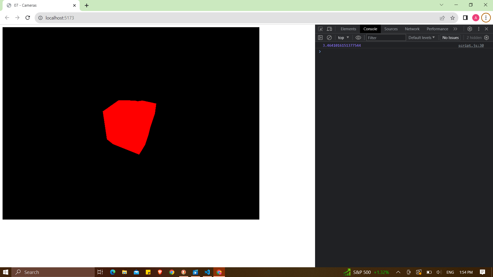

# Three.js

## Cameras

- There are 6 types of cameras and those are:

1. Camera
2. ArrayCamera
3. CubeCamera
4. OrthographicCamera
5. PerspectiveCamera
6. StereoCamera

- **Camera** class cannot be used directly and the rest of the cameras are inherited from them.

- **ArrayCamera** can be used to render the scene from multiple cameras on specific areas of the render.

- **StereoCamera** can be used to render the scene through two cameras that mimic the eyes to create the parallax effect.

- **CubeCamera** does the render for each one facing a different direction.

- **OrthographicCamera** does the render of the scene without any perspective.

- **PerspectiveCamera** is the most common one with max parameters.

```
const camera = new THREE.PerspectiveCamera(75, sizes.width / sizes.height)
```

- Here is the command for initializing the camera and the parameter **75** is known as field of view **FOV**.


- _FOV of 75_



- _FOV of 105_

### Near and Far

- These are the parameters that are used to define how close or far the camera is.

- Don't use extreme parameters then the model won't be displayed properly as shown in the picture below. These tend to glitches in the real-time environment.`

- 

- The default code for defining near and far is by:

```
const camera = new THREE.PerspectiveCamera(75, sizes.width / sizes.height,0.00001,3.4641016151377544)
camera.position.x = 2
camera.position.y = 2
camera.position.z = 2
camera.lookAt(mesh.position)
scene.add(camera)
```

### Orthographic Camera

- Till now we had been using perspective camera now we are switching to orthographic. The syntax for initializing an orthographi camera is:

```
const camera = new THREE.OrthographicCamera(left, right, top, bottom, near, far) // Coordinates are important
const camera = new THREE.OrthographicCamera(-1,1,1,-1, 0.1, 100)
```


- Now here the cube is not like a cube in the scene and it responds and acts accordingly to the height of the render screen.

- To fix that we can define the aspect ratio as the ratio of width and height of the render screen and multiply it to the left and right variable.

```
const aspectRatio = sizes.width / sizes.height
const camera = new THREE.OrthographicCamera(-1*aspectRatio,1*aspectRatio,1,-1,0.1,100)
camera.position.x = 2
camera.position.y = 2
camera.position.z = 2
console.log(aspectRatio)
camera.lookAt(mesh.position)
scene.add(camera)
```

- Now we would like to move the camera based on the motion of the mouse and to do that this is how it would happen, use the perspective camera for this and then position the camera in such a way that it is facing the cube in the straight direction.

- To do that we can use this line.

```
camera.position.z = 2
```

- Now we need to ensure that the change is reflected once the mouse has changed it's position and to do that we need to first detect the coordinates and to detect that we can use **addEventListener**. Using that we can retrieve the 'X' and 'Y' coordinates.

```
window.addEventListener('mousemove', (event) =>
{
    console.log(event.clientX, event.clientY)
})
```

- Now the coordinates have been recorded and it's reflecting on the console.


- These numbers are of huge range to deal with so to have an amplitude of **1** we can deal with it by creating a cursor variable and then perform a calculation on it that displays coordinates in that range. The limits should be **0.5** and **-0.5**.

```
const cursor = {
    x: 0,
    y: 0
}

window.addEventListener('mousemove', (event) =>
{
    cursor.x = event.clientX / sizes.width - 0.5
    cursor.y = event.clientY / sizes.height - 0.5
    console.log(cursor.x, cursor.y)
})
```

- Now that the camera coordinates have been recorded in the variable, use those variables to position the camera and move it based on the cursor coordinates in the tick function.

```
camera.position.x = cursor.x
camera.position.y = cursor.y
```

- Now that the camera is moving based on the cursor movement but the **Y** axis is moving according to the cursor and to invert that just change the formula to

```
cursor.y = - (event.clientY / sizes.height - 0.5)
```

- Increase the amplitude of the visual by multiplying cursor.x and cursor.y with necessary number in the **tick()** function.

```
camera.position.x = cursor.x * 3
camera.position.y = cursor.y * 3
```

- Using the **lookAt()** function and mesh position, we can keep the cube stationary and make the camera move according the cursor and make it look at the cube.

```
camera.lookAt(mesh.position)
```

- Only 5 faces of the cube are visible but we want to make the camera move around the cube and then show the sixth side too, to do that we can use mathematical functions like **Math.sin()**, **Math.cos()** and **Math.PI** to make sure all the faces are visible at all angles.

```
camera.position.x = Math.sin(cursor.x * Math.PI * 2) * 2
camera.position.z = Math.cos(cursor.x * Math.PI * 2) * 2
camera.position.y = cursor.y * 3
camera.lookAt(mesh.position)
```

- We don't need to write complicated code each and everytime to make everything working. Three.js has inbuilt **controls** to make use of and all we need to do is initialize and use it to work on our project. There are various types of controls and those are:

1. OrbitControls
2. FlyControls
3. TransformControls
4. FirstPersonControls
5. DragControls
6. MapControls

- We will be using **OrbitControls** to do so and to initialize that we can do it by using the node modules that are present in the directories and import that module to do the work.

```
import { OrbitControls } from 'three/examples/jsm/controls/OrbitControls.js' // console.log() to check if you want to.
```

- Comment the camera part in tick function, right after the cameras we can do **controls** section and then refer the camera to the controls class to make it work and then store the class in a variable. Add a 2nd dummy element within the canvas for the mouse to function.

```
const controls = new.OrbitControls(camera, canvas)
```

- Click and make the camera move! Zoom in and zoom out too.

- **Damping** is a phenomena to add some smooth animation and some friction to the canvas. This has to happen as per the frame so,

```
// In tick() function add
controls.update()

// near controls add
controls.enableDamping = true
```

- There are many other sub-parameters that can be used to get to our goal, refer the documentation.

- FINAL CODE

```
import * as THREE from 'three'
import { OrbitControls } from 'three/examples/jsm/controls/OrbitControls.js'

console.log(OrbitControls)

/**
 * Base
 */

// Cursor Coordinates

const cursor = {
    x: 0,
    y: 0
}

window.addEventListener('mousemove', (event) =>
{
    cursor.x = event.clientX / sizes.width - 0.5
    cursor.y = - (event.clientY / sizes.height - 0.5)
    // console.log(cursor.x, cursor.y)
})

// Canvas
const canvas = document.querySelector('canvas.webgl')

// Sizes
const sizes = {
    width: 800,
    height: 600
}

// Scene
const scene = new THREE.Scene()

// Object
const mesh = new THREE.Mesh(
    new THREE.BoxGeometry(1, 1, 1, 5, 5, 5),
    new THREE.MeshBasicMaterial({ color: 0xff0000 })
)
scene.add(mesh)

// Camera
const camera = new THREE.PerspectiveCamera(75, sizes.width / sizes.height,0.1,100)
/* const aspectRatio = sizes.width / sizes.height
const camera = new THREE.OrthographicCamera(-1*aspectRatio,1*aspectRatio,1,-1,0.1,100) */
// camera.position.x = 2
// camera.position.y = 2
camera.position.z = 2
// console.log(aspectRatio)
camera.lookAt(mesh.position)
scene.add(camera)

// Controls
const controls = new OrbitControls(camera, canvas)
controls.enableDamping = true

// Renderer
const renderer = new THREE.WebGLRenderer({
    canvas: canvas
})
renderer.setSize(sizes.width, sizes.height)

// Animate
const clock = new THREE.Clock()

const tick = () =>
{
    const elapsedTime = clock.getElapsedTime()

    // Update objects
    // mesh.rotation.y = elapsedTime;

    // Camera
    // camera.position.x = Math.sin(cursor.x * Math.PI * 2) * 2
    // camera.position.z = Math.cos(cursor.x * Math.PI * 2) * 2
    // camera.position.y = cursor.y * 3
    // camera.lookAt(mesh.position)

    // Render
    renderer.render(scene, camera)

    // Controls Update
    controls.update()

    // Call tick again on the next frame
    window.requestAnimationFrame(tick)
}

tick()
```
